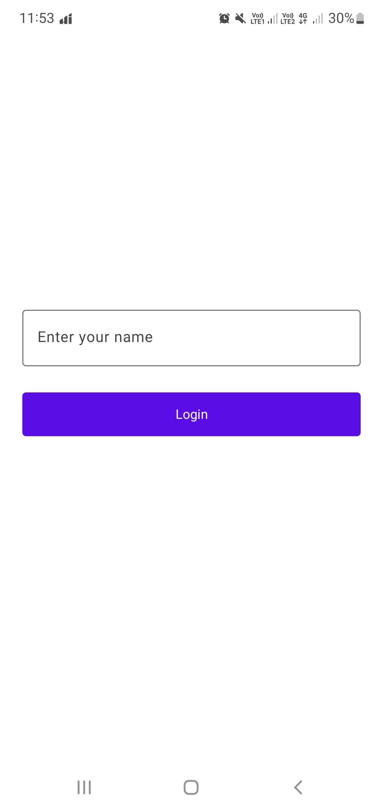
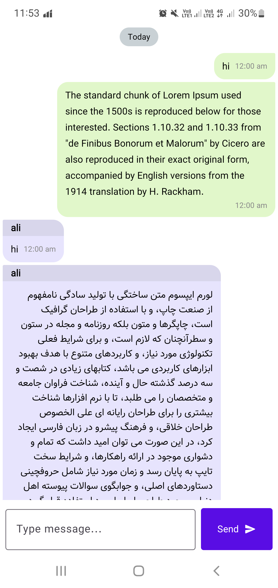

# Simple Android Messenger

A simple, real-time chat application for Android built with modern technologies.

  
  

## 🚀 Features

- **Real-time Messaging:** Send and receive text messages instantly.
- **User Identification:** Simple username-based login to distinguish between users.
- **Chat History:** Messages are stored in the cloud and synced across devices.
- **Clean UI:** A minimalist and user-friendly interface focused on the chat experience.
- **Date Headers:** Messages are grouped by date (e.g., "Today", "Yesterday") for better readability.

---

## 🛠️ Tech Stack & Architecture

This project is built using modern Android development practices and libraries.

- **Language:** [Kotlin](https://kotlinlang.org/)
- **Architecture:** MVVM (Model-View-ViewModel) + Clean Architecture principles.
- **Asynchronous Programming:** [Kotlin Coroutines](https://kotlinlang.org/docs/coroutines-guide.html) & [Flow](https://developer.android.com/kotlin/flow) for managing background tasks and handling data streams.
- **Dependency Injection:** [Hilt](https://dagger.dev/hilt/) for managing dependencies and improving modularity.
- **UI:** [Android Jetpack](https://developer.android.com/jetpack) components, including Navigation Component for handling in-app navigation.
- **Backend & Database:** [Firebase Realtime Database](https://firebase.google.com/products/realtime-database) for storing and syncing messages in real-time.

---

## ⚙️ Installation

You can install the app on any Android device or emulator.

1.  Go to the [**Releases**](https://github.com/amir-azari/Messenger/releases/tag/v1.0) page of this repository.
2.  Download the latest `app-release.apk` file.
3.  Open the downloaded file on your Android device to install it.

> **⚠️ Note: Play Protect Warning**
> When installing, you might see a warning from **Google Play Protect** because the app is not on the Play Store. This is normal.
> To proceed, tap on **"More details"** and then **"Install anyway"**.

---

## Usage

1.  **Launch the app.**
2.  **Enter a username** on the login screen. This name will identify you in the chat.
3.  You will be taken to the chat screen where you can start sending and receiving messages.

> **⚠️ Important Note for Users in Iran**
> This application uses Firebase services, which are currently blocked in Iran. To use the app, you **must** use a reliable VPN that does not leak your real IP address. Otherwise, the app will not be able to connect to the server.
